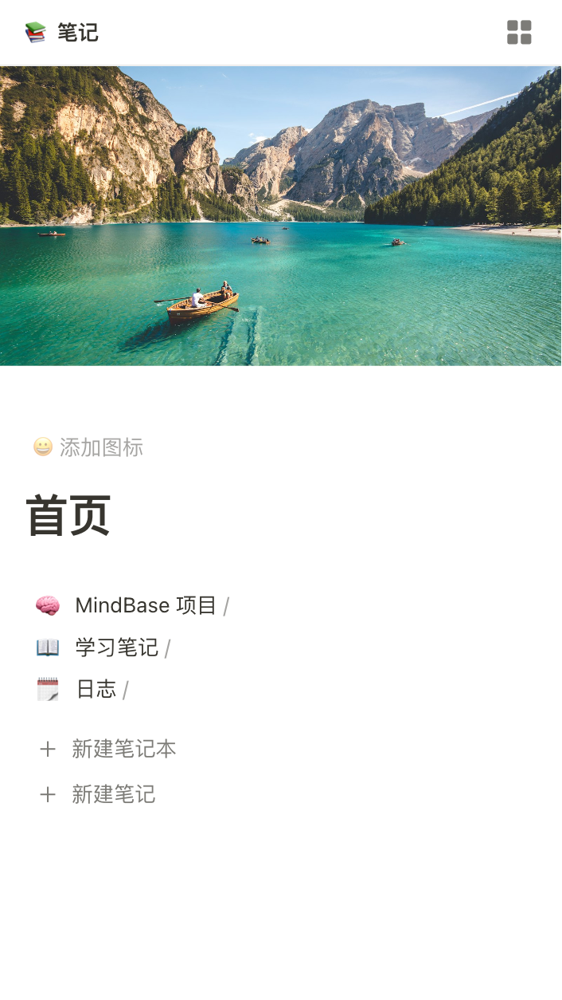
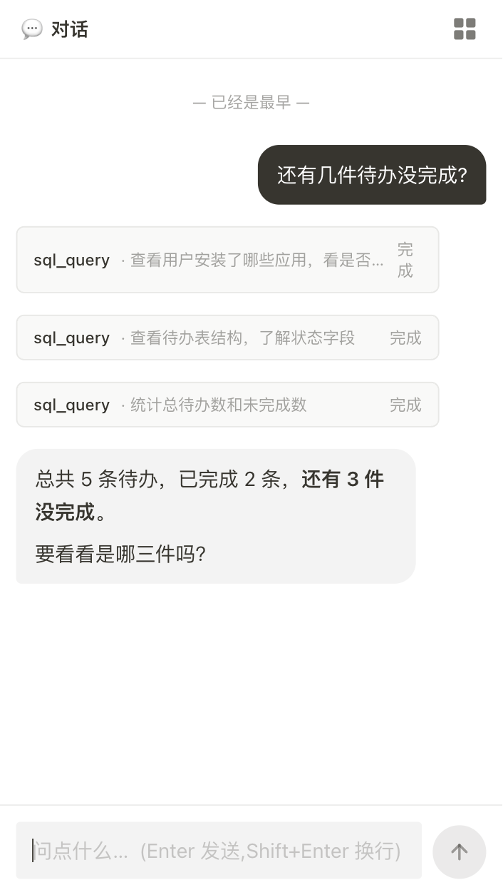
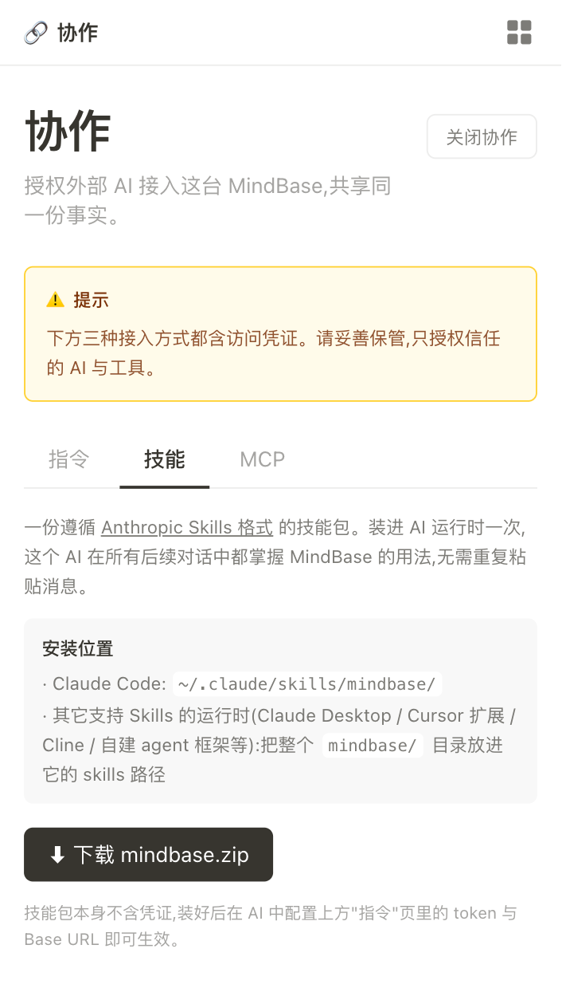
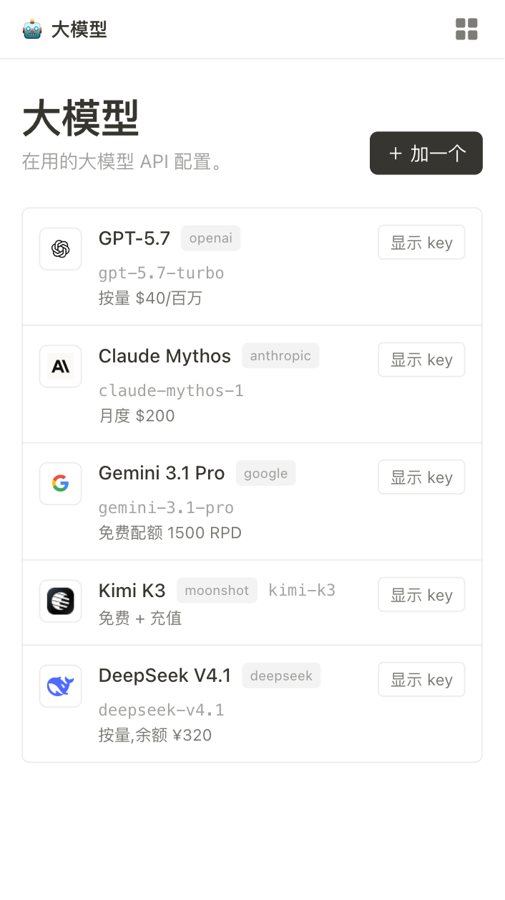
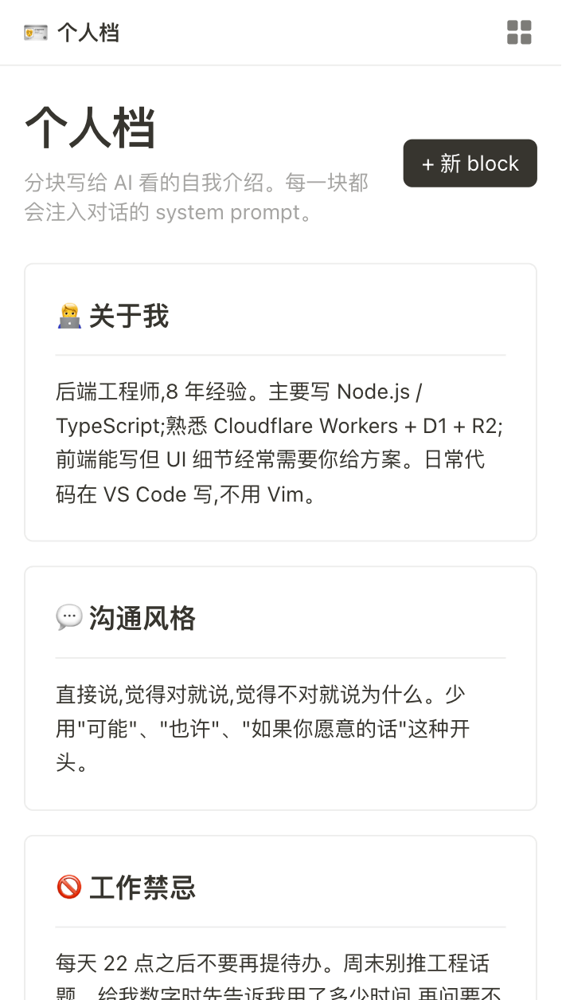
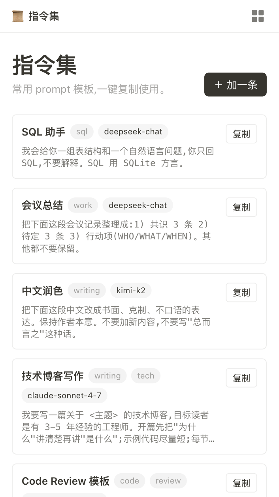
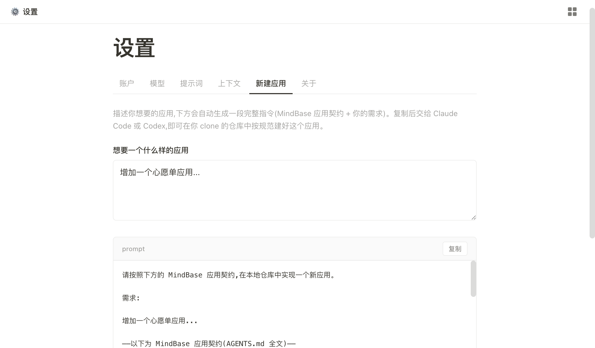

# MindBase

**同步你和 AI 的上下文。**

把记忆从抽象的数据变成自然的形状,每个应用就是你生活的一面 —— 你看见,AI 也看见。

<table>
  <tr>
    <td width="33%"></td>
    <td width="33%"></td>
    <td width="33%"></td>
  </tr>
  <tr>
    <td align="center"><sub>笔记 · 嵌套结构 + 封面</sub></td>
    <td align="center"><sub>对话 · AI 跑 sql_query 直查</sub></td>
    <td align="center"><sub>协作 · 指令 / 技能 / MCP</sub></td>
  </tr>
</table>

---

## 🏠 自建

依托 **Cloudflare Workers + D1**,跑在你自己的账号下。

- **几乎零成本** —— 个人使用规模下 CF 的免费额度完全够用
- **30 天时间点恢复** —— D1 内建 point-in-time recovery,误删不怕
- **数据永远在你手上** —— 一行 `wrangler d1 export` 整库带走,SQL 文件去哪都能进
- **开源、自部署** —— 代码 MIT,你的 token、你的 JWT secret、你的钥匙

---

## 🌱 自然

记忆不再是一条一条扁平的数据。每个应用都**具备它本该有的形状、交互和功能** —— 你看见就知道它是什么,不需要翻译字段。

- 🎬 电影是 2:3 海报方块 —— 一眼就是电影
- 📖 书是书脊 —— 一眼就是书
- 💳 银行卡是 `**** **** **** 1234` —— 一眼就是卡
- 🎯 目标是进度条 + 大圆 "+1" 按钮
- 🖼️ 影集是照片网格
- 🔐 密码是 `•••` mask + "显示" 按钮
- 💰 记账是 `+` 绿 / `−` 红 + ¥ 数字

**眼睛 = 大脑,没有翻译那一步。**

<table>
  <tr>
    <td width="33%"></td>
    <td width="33%"></td>
    <td width="33%"></td>
  </tr>
  <tr>
    <td align="center"><sub>大模型 · 厂商 logo + 配额</sub></td>
    <td align="center"><sub>足迹 · 地点封面图</sub></td>
    <td align="center"><sub>个人档 · 关于我的事实块</sub></td>
  </tr>
</table>

---

## 🧩 核心 + 商店

核心预置 12 个常用应用 —— 🏠 主页 · ✅ 待办 · 📚 笔记 · 💰 记账 · 📂 项目 · 🪪 个人档 · 🤖 大模型 · 📜 指令集 · 🔑 API · 📧 邮箱 · 🌐 域名 · 🗺️ 足迹。其它 30 个生活应用在 [**mindbase.me**](https://mindbase.me) 应用商店按需安装,装多少全看你自己。

商店现成的有(按生活类别归组):

| 类别 | 应用 |
|---|---|
| 🌊 **流水** | ✅ 待办 · 💰 记账 · 📅 日程 · 🕰️ 回忆 · ❤️ 健康 |
| 📝 **内容** | 📚 笔记 · 🪟 网页 · 📜 指令集 · ✍️ 文章 |
| 🎬 **品味** | 电影 · 📖 书单 · 🎵 音乐 · 🎮 游戏 · 🎨 展览 · 🎤 演唱会 |
| 🍳 **生活** | 菜谱 · 🖼️ 影集 · 🗺️ 足迹 · ✈️ 旅行 · 📂 项目 · 🎯 目标 · 🎁 心愿单 |
| 💎 **资产** | 资产 · 💳 银行卡 · 💸 订阅 · 📘 说明书 · 💻 设备 · 🛂 证件库 · 🌐 域名 |
| 🪪 **身份** | 个人档 · 📄 简历 · 👥 通讯录 · 📧 邮箱 · 🆔 网络账号 |
| 🔐 **凭据** | 密码箱 · 🔑 API · 🤖 大模型 · 🖥️ 服务器 |

系统页面(💬 对话 · 🔗 协作 · ⚙️ 设置)默认就在,不算装的应用。

商店里每个应用就是一个 zip:`manifest + service + repository + api + .vue` 加上一段 schema —— 解压丢进 `apps/<name>/` 和 `gui/apps/<name>/`,在 `schema.sql` 应用段 append 一节,在 `server/apps/registry.js` 加一行 entry,redeploy 就装上。前端的路由、启动器、launcher 入口全部 `import.meta.glob` 自动派生,不用碰。

---

## 🔄 同步

一份数据,**所有 AI 共用** —— 聊任何话题都不丢上下文。

### 内置助理(产品里的"对话")

D1 直连,**只有一把工具:`sql_query`**。它能聚合("上个月外卖花了多少")、跨应用整理("把今天主页帖子整理成笔记")、批量更新 —— 所有 SQL 在对话里展开可见,主动访问是可观测的。OpenAI 兼容,任何 base URL 都能填(DeepSeek / SiliconFlow / 自部署 vLLM)。

### 外部 AI(Claude Code / Codex / ChatGPT / Cursor / Cline …)

`设置 → 协作` 一键开启,拿到一把 `mb_` token。两种接入:

- **Anthropic Skill(长期使用)** —— 下载 zip,放进 AI 运行时的 skills 目录,这个 AI 长期就"会用" MindBase。
  ```
  https://github.com/realuckyang/mindbase/raw/main/mindbase.zip
  ```
  - Claude Code: `~/.claude/skills/mindbase/`
  - 其它支持 Anthropic Skills 的工具:查它各自的 skills 路径

- **OpenAPI 3.1(零安装)** —— 把 schema URL + token 粘进 ChatGPT / 任何支持 OpenAPI 的 AI,30 秒接入,AI 自己读 schema 干活。

同一把 token,N 个 AI 共用同一份事实。

<table>
  <tr>
    <td width="33%"></td>
    <td width="33%"></td>
    <td width="33%"></td>
  </tr>
  <tr>
    <td align="center"><sub>内置对话 · sql_query 一把工具</sub></td>
    <td align="center"><sub>外部 AI · Anthropic Skill 包</sub></td>
    <td align="center"><sub>指令集 · 复用 prompt 模板</sub></td>
  </tr>
</table>

---

## 🛠️ 创造

**生活在长,应用在长**。商店里没有的,自己 30 分钟就能加一个。

仓库根的 `AGENTS.md` 讲清楚契约:`apps/<name>/` 一捆 4 个文件、`gui/apps/<name>/index.vue` 一个视图、`schema.sql` 应用段 append 一节、`server/apps/registry.js` 加一行 —— 完事。

最高效用法 —— 把 mindbase clone 到本地,告诉 Codex 或 Claude Code:

> "按 AGENTS.md 加一个 plants 应用,记我的多肉:名字、买入日期、上次浇水、备注。"

跑 `npm run deploy`,你自己的 MindBase 就多了一面。AI 也立刻看得见 —— 因为表叫 `app_plants_items`,自动落进它的视野规则(`app_<name>_*` 表前缀决定 AI 视野)。

<p align="center">
  
</p>
<p align="center"><sub>设置 → 新建应用 · 写下你想要的应用,自动拼出 prompt + AGENTS.md 全文,复制给 AI 即可</sub></p>

---

## 🚀 自己部署一份

需要:**Cloudflare 账号**、**Node 22+**

```bash
git clone https://github.com/realuckyang/mindbase
cd mindbase && npm install

# 1. 建 D1 + R2
npx wrangler d1 create mindbase
npx wrangler r2 bucket create mindbase

# 2. 填配置
cp wrangler.example.jsonc wrangler.jsonc
# 改 account_id / database_id / JWT_SECRET(随便生成一串长字符串)

# 3. 建表(单一 SQL 文件,系统和应用全在一处)
npx wrangler d1 execute mindbase --remote --file=schema.sql --yes

# 4. 部署
npm run deploy
```

第一次访问让你 setup 用户名 + 密码(存进你自己 D1,PBKDF2 哈希),之后用密码登录。

备份整库:

```bash
npx wrangler d1 export mindbase --remote --output backup-$(date +%Y%m%d).sql
```

---

## 🧱 技术栈

| 层 | 用了什么 |
|---|---|
| 运行时 | Cloudflare Workers |
| 存储 | D1 (SQLite) + R2 (图片) |
| 鉴权 | PBKDF2 + HS256 JWT cookie(180 天) |
| 前端 | Vue 3 + Vite + Tailwind v4 |
| AI | OpenAI 兼容 Chat Completions + 流式 + 工具调用 |
| 标准 | OpenAPI 3.1 + Anthropic Skills |

后端 `apps/<name>/` 一捆 `{manifest, repository, service, api}.js`;系统应用同形态住在 `system/apps/`;数据库 schema 全在 `schema.sql` 一个文件里。

```
mindbase/
  schema.sql                 单一事实源 DDL(系统 + 应用全在这一处)
  AGENTS.md                  给 AI 加应用的契约
  server/
    index.js                 Worker 入口
    router.js                /api/<name> 统一分发(双 registry 合并)
    apps/<name>/             每个用户应用一捆(manifest/repository/service/api)
    system/
      auth/  utils/  image/  跨应用基础设施
      apps/<name>/           系统应用(chat/collab/settings/user)同形态
    collab/                  对外 AI 接入(openapi / mcp)
  gui/
    main.js  App.vue  router.js  api.js
    apps/<name>/             用户应用 UI
    system/
      apps/<name>/           系统应用 UI
      components/            AppShell / Popover / Cover ...
      composables/ lib/      跨应用 hook / 工具
      layout/ create/        系统页(无应用归属)
  skills/mindbase/           打成根目录 mindbase.zip 的 SKILL.md 源
```

---

## License

[MIT](./LICENSE) —— 拿去改、拿去用,觉得有用 ⭐ 一下。
