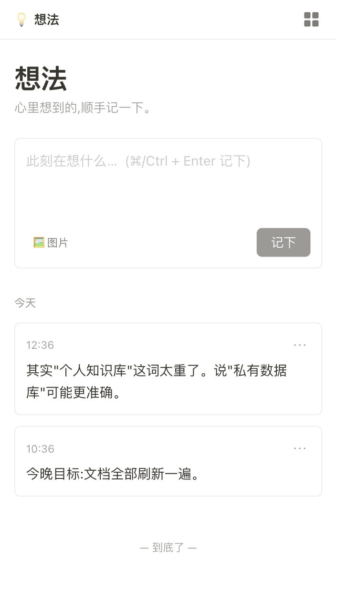
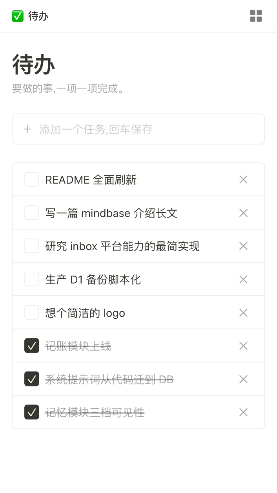
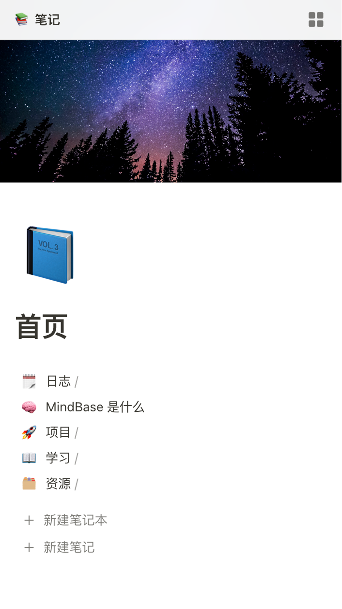
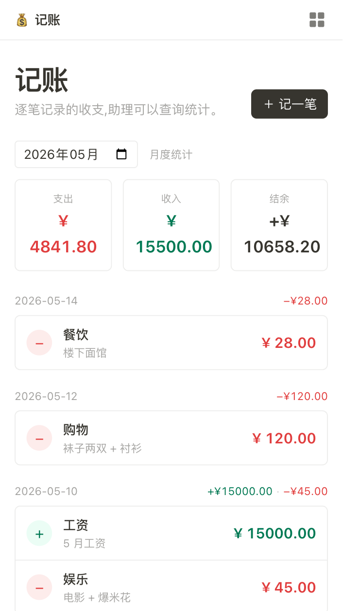
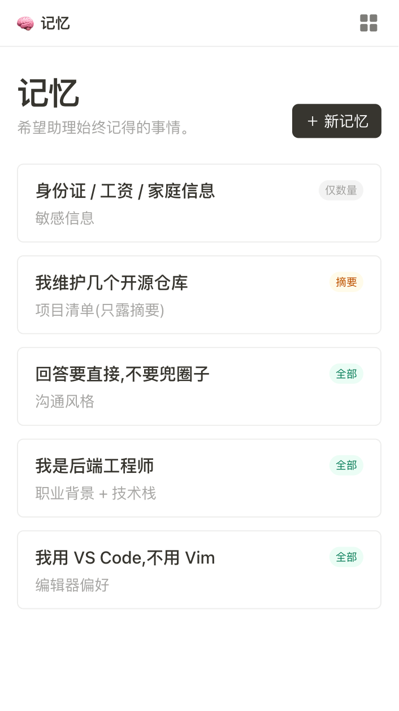
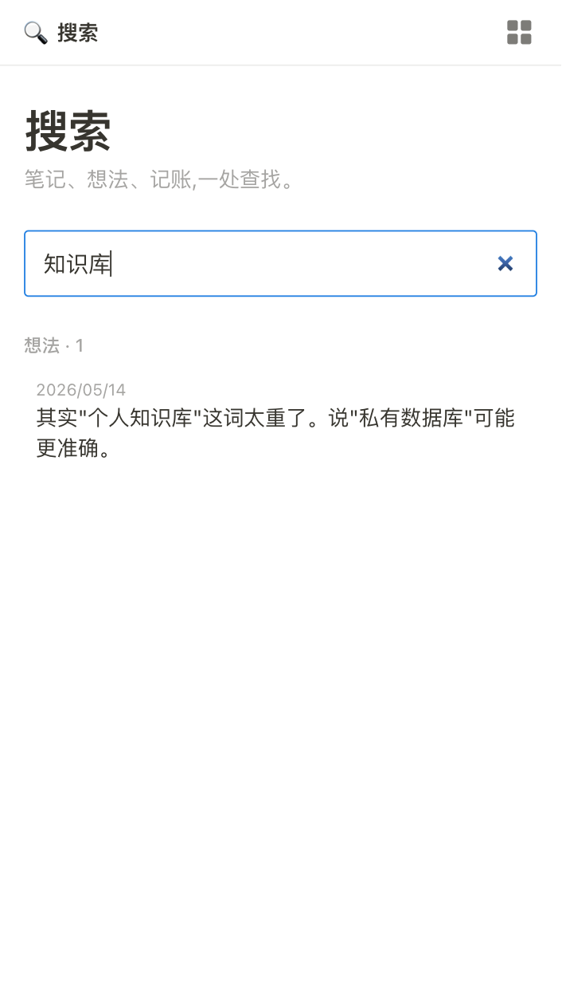
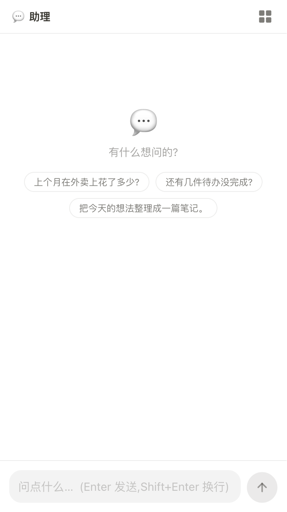
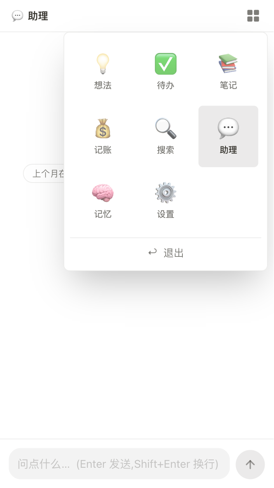

# MindBase

**自建你和 AI 共同的知识库。**

🧠 一份 D1 数据库,你和 AI 共用 —— 笔记 / 想法 / 待办 / 记账 / 记忆,谁写谁读都行  
📦 部署在你自己的 Cloudflare 账号下,数据全在 D1 里,可以随时 <code>wrangler d1 export</code> 导出带走  
🤖 内嵌助理 + 外部 AI(ChatGPT / Claude / Gemini …)都直接读写同一份数据,共享一致的事实背景

---

## 想法

<table>
<tr>
  <td width="55%" valign="top">
    <h3>💡 心里想到的,顺手记一下。</h3>
    <p>时间线随手记。<code>⌘ + Enter</code> 记下,<code>⌘ + V</code> 直接粘截图;
    图片传到你自己的 R2 桶,删想法时自动清理。</p>
    <p>按天分组,沉淀下来就是一本属于自己的日记。</p>
  </td>
  <td width="45%" valign="top">
    
  </td>
</tr>
</table>

---

## 待办

<table>
<tr>
  <td width="45%" valign="top">
    
  </td>
  <td width="55%" valign="top">
    <h3>✅ 要做的事,一项一项完成。</h3>
    <p>没有项目、没有标签、没有优先级 —— 一个清单,加进去、勾掉、删掉。</p>
    <p>克制是这个模块的设计原则。</p>
  </td>
</tr>
</table>

---

## 笔记

<table>
<tr>
  <td width="55%" valign="top">
    <h3>📚 无限嵌套笔记本,Notion 风可定制图标和封面。</h3>
    <p>笔记本可以无限嵌套,每个笔记本和笔记都能配 emoji 图标 + 封面图(8 张预置或自己上传)。</p>
    <p>编辑器是 Notion 风:H1/H2/H3、粗斜体、行首 <code>#</code> Markdown 快捷键、粘贴即上传图。</p>
    <p>三种拖动语义:同级<strong>重排</strong> / 拖到笔记本上 0.5s 自动<strong>嵌套</strong>进去 / 拖到面包屑<strong>跨级移动</strong>。</p>
  </td>
  <td width="45%" valign="top">
    
  </td>
</tr>
</table>

---

## 记账

<table>
<tr>
  <td width="45%" valign="top">
    
  </td>
  <td width="55%" valign="top">
    <h3>💰 逐笔记录的收支,助理可以查询统计。</h3>
    <p>每一笔收 / 支记下来,按日期分组,顶部显示当月支出 / 收入 / 结余三块统计。</p>
    <p>金额用整数"分"存,永远不出现浮点误差。分类是自由文本,但会按用过的历史自动补全。</p>
    <p>问助理"上个月在外卖上花了多少",直接得到结果。</p>
  </td>
</tr>
</table>

---

## 记忆

<table>
<tr>
  <td width="55%" valign="top">
    <h3>🧠 希望助理始终记得的事情。</h3>
    <p>你写下来的长期事实,会拼进助理的 system prompt,每轮对话都看得到 —— 不用每次重新说"我是后端工程师"或者"回答时直接说重点"。</p>
    <p>三档可见性,控制<strong>默认注入 system prompt 的多少</strong>:</p>
    <ul>
      <li><strong>必读</strong> —— 全部注入,助理把它当成事实背景</li>
      <li><strong>摘要</strong> —— 看得到标题 + 一句话简述,正文默认不可见</li>
      <li><strong>已存</strong> —— 助理只知道"有这条",任何字段默认看不到</li>
    </ul>
    <p>助理始终带 SQL 工具,需要时可以 <code>SELECT memories</code> 读到更多 —— 但你能看到它写的查询,主动访问是<strong>可观测</strong>的。适合身份证、工资单这种你想自己有记录、不希望被默认带进 prompt 的信息。</p>
  </td>
  <td width="45%" valign="top">
    
  </td>
</tr>
</table>

---

## 搜索

<table>
<tr>
  <td width="45%" valign="top">
    
  </td>
  <td width="55%" valign="top">
    <h3>🔍 笔记、想法、记账,一处查找。</h3>
    <p>一个关键词,跨所有模块。结果按类型分组,点击直达原文。</p>
  </td>
</tr>
</table>

---

## 助理

<table>
<tr>
  <td width="55%" valign="top">
    <h3>💬 接入任意大模型,读写你的库。</h3>
    <p>OpenAI 兼容协议,任何 base url 都能填(DeepSeek、SiliconFlow、自部署的 vLLM 都行)。</p>
    <p>带一个 <code>sql_query</code> 工具,可以直接对 D1 写 SQL。问"上个月外卖花了多少"它能给你算出来,让它"把今天的想法整理成一篇笔记"它能跨模块完成。</p>
    <p>启用的「记忆」会自动注入 system prompt,模型当前用什么、运行在什么环境也都会告诉它。</p>
  </td>
  <td width="45%" valign="top">
    
  </td>
</tr>
</table>

---

## 七个模块,一份数据库

<p align="center">
  
</p>

笔记 / 想法 / 待办 / 记账 / 记忆 / 搜索 / 助理 —— 共用一份 SQLite。助理一次能看全,跨模块整理零摩擦。

---

## AI 怎么接进来

`设置 → 协作` 一键开启,拿到一把 token + 一段快捷消息。两种用法:

### 1. 粘给在线 AI(零安装)

复制快捷消息,粘到 ChatGPT / Claude / Gemini 等任意聊天框 —— AI 自己 fetch schema 干活。30 秒搞定。

### 2. 装技能包(Anthropic Skills,长期使用)

下载 `mindbase-skill.zip`,放进 AI 运行时的 skills 目录:

- **Claude Code**: `~/.claude/skills/mindbase/`
- **其它支持 Skills 的工具**(Claude Desktop / Cursor 扩展 / Cline / 自建 agent 框架等):查它各自的 skills 路径

底层是 OpenAPI 3.1 schema(`/api/ai/openapi.json`),GPT Actions / Claude Custom Connector / 任何支持 OpenAPI 的工具都能 import。

AI 拿到**读 + 写**所有数据的权限,token 一旦泄漏立刻在「协作」里关掉即作废。

---

## 自己部署一份

需要:**Cloudflare 账号**、**Node 22+**

```bash
git clone https://github.com/realuckyang/mindbase
cd mindbase && npm install

# 1. 建 D1 + R2(记下返回的 database_id)
npx wrangler d1 create mindbase
npx wrangler r2 bucket create mindbase

# 2. 填配置
cp wrangler.example.jsonc wrangler.jsonc
# 改 account_id / database_id / JWT_SECRET(随便生成一串长字符串)

# 3. 建表
npx wrangler d1 execute mindbase --remote --file=mindbase.sql --yes

# 4. 部署
npm run deploy
```

打开你的 Workers 域名,第一次访问会让你创建账号(用户名 + 密码,存进你自己的 D1,PBKDF2 哈希)。之后用密码登录,session 是 HS256 JWT(签名 key 就是 `JWT_SECRET`)。

本地开发 `npm run dev`,打开 <http://localhost:5173>。

### 备份你的数据

```bash
npx wrangler d1 export mindbase --remote --output backup-$(date +%Y%m%d).sql
```

整份数据库就是一个 SQL 文件,导出来想干嘛干嘛。

---

## 技术栈

| 层 | 用了什么 |
|---|---|
| 运行时 | Cloudflare Workers(边缘 fetch handler) |
| 存储 | D1(SQLite)+ R2(图片)|
| 鉴权 | PBKDF2 哈希密码,HS256 JWT cookie,180 天过期 |
| 前端 | Vue 3 + Vite + Tailwind CSS v4 + `@cloudflare/vite-plugin` |
| AI | OpenAI 兼容 Chat Completions 接口(任意 base url),流式 + 工具调用 |
| 标准 | OpenAPI 3.1(外部 AI 接入)· Anthropic Skills(技能包格式) |

后端 `api → service → repository` 三层。所有配置在 `wrangler.jsonc`(gitignore),private 值不进 bundle。

---

## 项目结构

```
mindbase/
  mindbase.sql              单一事实源,所有表的 DDL
  server/
    api/                    HTTP 路由,只做参数校验 + 转发
    service/                业务流程编排 + 鉴权
      prompt/               助理系统提示词组装器(环境 / 模型 / 记忆)
    repository/             D1 SQL
    domain/auth/            JWT + PBKDF2 + API token
    ai/                     LLM 调用 + 工具循环
    llm/                    多 provider 适配(OpenAI 兼容 + 自定义)
  src/
    views/                  每个模块一个顶层 .vue
    components/             共享组件(emoji picker / 封面 / popover / 编辑器…)
    lib/, api/, composables/, router/
  skills/mindbase/          打成 zip 给外部 AI 装的 SKILL.md
```

---

## License

[MIT](./LICENSE) —— 拿去改、拿去用,觉得有用 ⭐ 一下。
